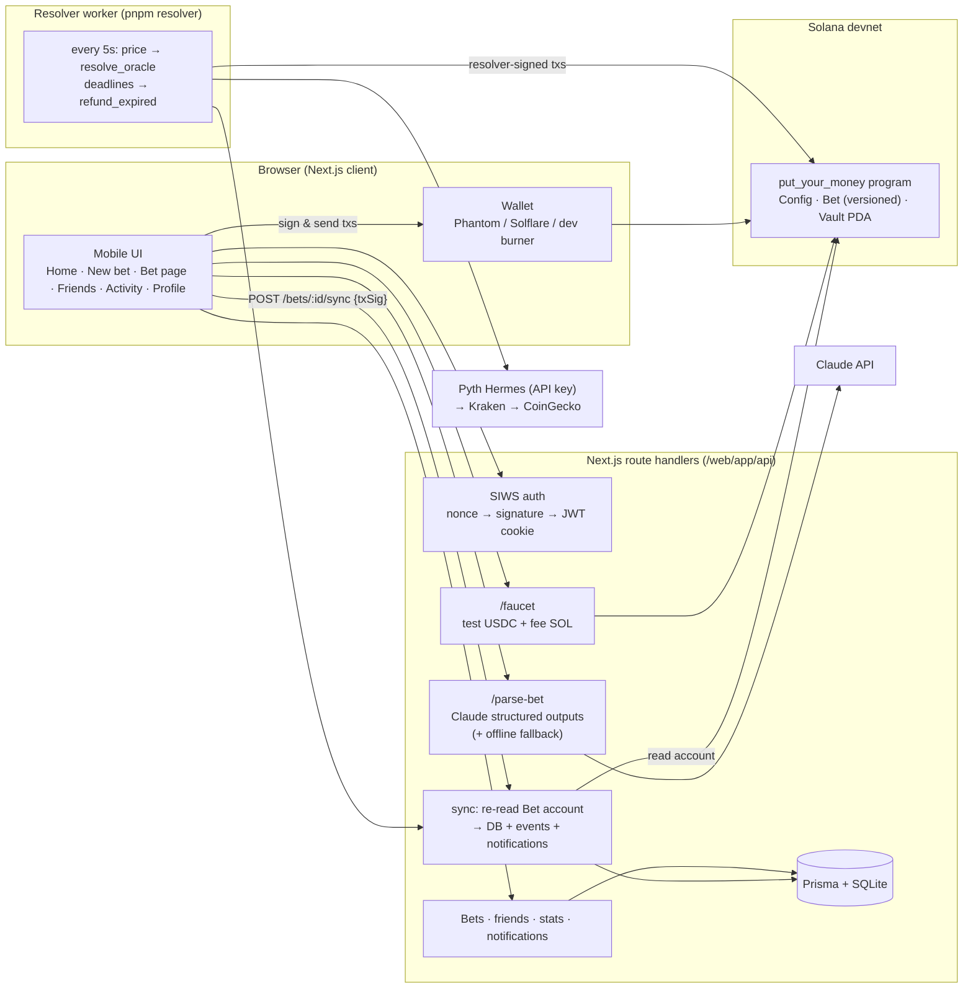

# SolMog 💸

A mobile-first web app that turns "I bet you $10 SOL hits $250 tonight" into a real, on-chain agreement
between friends:

1. **Type the bet in plain English** → AI turns it into precise terms you can edit.
2. **Challenge a friend** → they accept, decline, or **counteroffer** (different stakes, sides or odds).
   Every counteroffer is a new on-chain version; you can only accept the exact version you saw.
3. **Both sides lock test-USDC** in a Solana program escrow.
4. **It resolves itself** — a price oracle settles crypto bets; everything else settles when both people
   agree on the winner.
5. **The winner gets the whole pot**, straight from the program. Every step links to Solana Explorer.

It's a social app, not a sportsbook: dollar amounts and friendly names up front, solana under the hood.
**Runs on Solana devnet with a test USDC mint we create. No real money anywhere.**

---

## Architecture



**The chain is the source of truth for money and terms.** Clients send their own transactions (the server
never holds user keys), then tell the server "something happened". The server re-reads the `Bet` account
and updates the DB from chain data only. Negotiation lives on-chain: `accept(expected_version)` fails if
the terms changed, so nobody can bait-and-switch before acceptance. A sha256 of the human-readable terms
is stored on-chain with every version.

| Path | What |
| --- | --- |
| `programs/put_your_money/` | Anchor program: config, create/counter/accept/cancel, fund, oracle + mutual resolution, refunds. Rust LiteSVM tests. |
| `web/` | Next.js 15 app: UI, API routes, Prisma schema, shared Solana client (`web/lib/solana`), resolver core (`web/lib/server/resolver.ts`). |
| `scripts/` | `setup-devnet.ts`, `resolver.ts`, `seed-demo.ts`, `e2e.ts` (API + chain walkthrough), `anchor.sh` (WSL build wrapper). |

### Bet lifecycle (on-chain `BetState`)

`Proposed` (v1, v2, … counteroffers) → `Accepted` (30 min to fund) → `Active` (both funded) →
`Settled` (oracle, or `AwaitingConfirmation` → confirm for mutual). Side exits: `Cancelled` (declined /
withdrawn), `Expired` (not accepted or not funded in time; funded side refunded), `Void` (nobody resolved
it within 48h of the deadline, or both agreed to call it off; both refunded).

---

## Setup

### Prerequisites
- Node 22 and pnpm 10
- Rust, Solana CLI 3.x, and **Anchor CLI 1.1.2**. On Windows these live in **WSL (Ubuntu)**;
  `scripts/anchor.sh` runs Anchor inside WSL automatically. On macOS/Linux it runs natively.
- A devnet wallet at `~/.config/solana/id.json` with ~3 devnet SOL to deploy (from https://faucet.solana.com).

### 1. Install and build
```bash
pnpm install
cp web/.env.example web/.env.local      # then set JWT_SECRET and CRON_SECRET to random strings
echo 'DATABASE_URL=file:./dev.db' > web/.env   # Prisma CLI reads .env
pnpm --filter web db:push
pnpm anchor:build                        # builds the program, copies IDL + types into web/lib/idl
```
The program keypair lives in `keys/put_your_money-keypair.json` (gitignored), so the program ID stays
`9gCvDMSSSqsCARyrubQTwUcC88U52YvM7CCd1zuUGZiG`. On a fresh clone, generate your own with
`solana-keygen new -o keys/put_your_money-keypair.json`, then update `declare_id!` in
`programs/put_your_money/src/lib.rs` and `Anchor.toml`.

### 2. Deploy and configure devnet
```bash
pnpm anchor:deploy                                   # anchor deploy --provider.cluster devnet
pnpm setup:devnet --write-env                        # keys, test USDC mint, program Config, env values
# If the devnet faucet rate-limits the airdrops, fund the printed addresses at faucet.solana.com,
# or pass a funded keypair: pnpm setup:devnet --write-env --funder ~/.config/solana/id.json
```
`setup-devnet.ts` generates or loads keypairs in `keys/` (admin, resolver, mint authority, mint), creates
the 6-decimal **Test USDC** mint, initializes the program `Config` (resolver authority and allowed
mint), and prints (or writes, with `--write-env`) `NEXT_PUBLIC_USDC_MINT`, `RESOLVER_SECRET_KEY` and
`MINT_AUTHORITY_SECRET_KEY`. It's idempotent.

**Local alternative (no devnet SOL needed):** run `solana-test-validator --reset --bpf-program
9gCvDMSSSqsCARyrubQTwUcC88U52YvM7CCd1zuUGZiG <path>/put_your_money.so`, then
`pnpm setup:devnet --url http://127.0.0.1:8899 --write-env`.

### 3. Run
```bash
pnpm dev          # http://localhost:3000
pnpm resolver     # separate terminal: settles oracle bets, refunds expired ones
pnpm seed:demo    # optional: creates justin + alex, friends and funded, and prints one-click login links
```

### Environment (`web/.env.local`)
| Var | Purpose |
| --- | --- |
| `NEXT_PUBLIC_RPC_URL` | Solana RPC (devnet by default) |
| `NEXT_PUBLIC_PROGRAM_ID`, `NEXT_PUBLIC_USDC_MINT` | Program and test-USDC mint |
| `NEXT_PUBLIC_ENABLE_BURNER` | Show the dev-only in-browser burner wallet |
| `NEXT_PUBLIC_EXPLORER_CLUSTER` | `devnet` or `localnet` (Explorer links) |
| `NEXT_PUBLIC_DEMO_MODE`, `NEXT_PUBLIC_DEMO_MINUTES` | ⚡ Demo prefill button on New Bet (default 3-minute bet) |
| `DATABASE_URL` | Prisma (SQLite file; Postgres-compatible schema) |
| `JWT_SECRET` | Session cookie signing |
| `ANTHROPIC_API_KEY`, `ANTHROPIC_MODEL` | Natural-language parsing (default `claude-sonnet-5`). Optional: without a key, a pattern-matching parser is used. |
| `RESOLVER_SECRET_KEY` | Oracle resolver authority (must match program `Config.resolver`) |
| `MINT_AUTHORITY_SECRET_KEY` | Test-USDC mint authority; also pays for faucet SOL |
| `CRON_SECRET` | Protects `POST /api/cron/resolve` |
| `PYTH_API_KEY` | Optional. Pyth Hermes has required a key since Aug 2026. Without it, prices come from Kraken, then CoinGecko. |
| `RESOLVER_INTERVAL_MS` | Resolver loop interval (default 5000) |

---

## The resolver

`pnpm resolver` loops every few seconds. It can also be triggered by hosted cron:
`POST /api/cron/resolve` with `Authorization: Bearer $CRON_SECRET`. Each pass:
- **Oracle bets that are `Active`:** fetches SOL/BTC/ETH. `TOUCH_ABOVE`/`TOUCH_BELOW` resolve **YES as
  soon as the threshold is touched**, or NO once the deadline passes. `ABOVE_AT`/`BELOW_AT` resolve once
  the deadline passes, using the price at that moment.
- **Anything past a deadline:** calls `refund_expired`. Unaccepted offers expire, partially funded bets
  refund, and bets unresolved 48h after their deadline refund both sides.
- **Logging and records:** every action is logged with its tx signature, and the price, source and
  publish time are stored in the bet's activity feed ("Resolved by Kraken: SOL = $120.59 at 7:20 AM").

The program double-checks the resolver: `resolve_oracle` rejects a winner that contradicts the reported
price, and rejects deadline-based bets resolved early.

## Hosting (Railway + your domain)

The site runs as **one service**: the Next.js server with the resolver loop inside it
(`RUN_RESOLVER_IN_APP=true`, started from `web/instrumentation.ts`), with SQLite on a persistent volume.
`railway.json` sets the build/start commands and a `/api/health` check.

1. railway.com → **New Project → Deploy from GitHub repo** → pick this repo (root directory `/`).
2. Service → **Settings → Volumes → Add volume**, mount path `/data`.
3. Service → **Variables**: copy everything from `web/.env.local`, then set/override
   `DATABASE_URL=file:/data/putyourmoney.db` and `RUN_RESOLVER_IN_APP=true`. (`NEXT_PUBLIC_*` values are baked
   in at build time, so redeploy after changing them.)
4. Deploy. Every start creates or updates the database schema (`prisma db push`, part of `pnpm start`). To create the demo users, run the
   seed **on the server** (the database lives on its volume): `railway ssh -- pnpm seed:demo --app https://yourdomain.com`.
   It prints fresh one-click `?demoKey=` links for Justin and Alex.
5. **Custom domain:** Service → Settings → Networking → **Custom Domain** → enter `yourdomain.com` → add the
   CNAME record Railway shows at your registrar. HTTPS is automatic.
6. In the Helius dashboard, restrict your API key to your domain (the RPC URL is visible to browsers).

Locally, `pnpm prod` (production build) is dramatically faster than `pnpm dev`, which compiles each page on
first visit; use it for demos.

## Tests
```bash
pnpm anchor:test                 # 15 program tests (Rust + LiteSVM, with clock warping)
pnpm --filter web test           # unit tests: odds and money math, terms hashing, resolver decisions, parser
pnpm --filter web typecheck && pnpm --filter web lint
pnpm --filter scripts e2e        # full API + on-chain walkthrough (needs pnpm dev and a cluster)
```
The e2e script signs in two users with real SIWS signatures, then runs friend requests and the faucet.
It then runs an oracle bet (counteroffer, stale-version rejection, funding), a mutual bet (propose,
dispute, confirm), a decline, and resolver scenarios (touch early-YES, at-deadline NO, expiry).
Balances are asserted on-chain.

## Demo
See **[DEMO.md](DEMO.md)** for the click-by-click script.

## Known limitations
- **Trusted resolver.** Oracle bets are settled by a server-held resolver key. The program checks that
  the claimed winner matches the reported price, but it trusts the price itself. The stretch goal is to
  verify Pyth price accounts on-chain inside `resolve_oracle`.
- **Price at the deadline.** The resolver uses the latest price when it runs (within ~5s of the deadline),
  not a historical price pinned to the exact second. Touch bets are sampled every few seconds, so a
  sub-second wick could be missed.
- **Devnet only**, with a self-minted test USDC. `initialize_config` is first-come; on mainnet it would be
  gated to the program's upgrade authority.
- **Disputes are mutual-agreement only.** If two friends never agree on a mutual bet, it refunds 48h
  after the deadline. There's no arbitration.
- **Sessions are cookies and burner keys live in localStorage.** To demo two users on one machine, use
  a normal window plus a private window (or two browsers). The burner wallet is for development only.
- **Public challenges, sports oracles and share cards are not built** (stretch goals).
